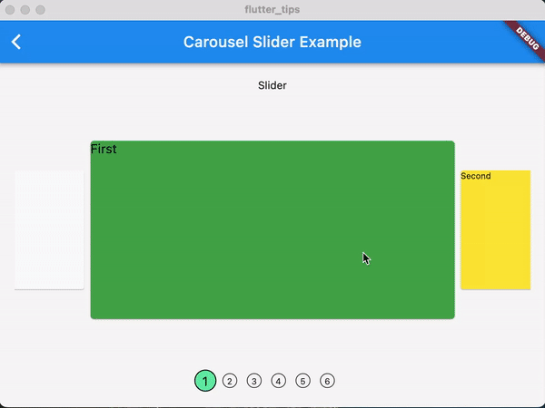
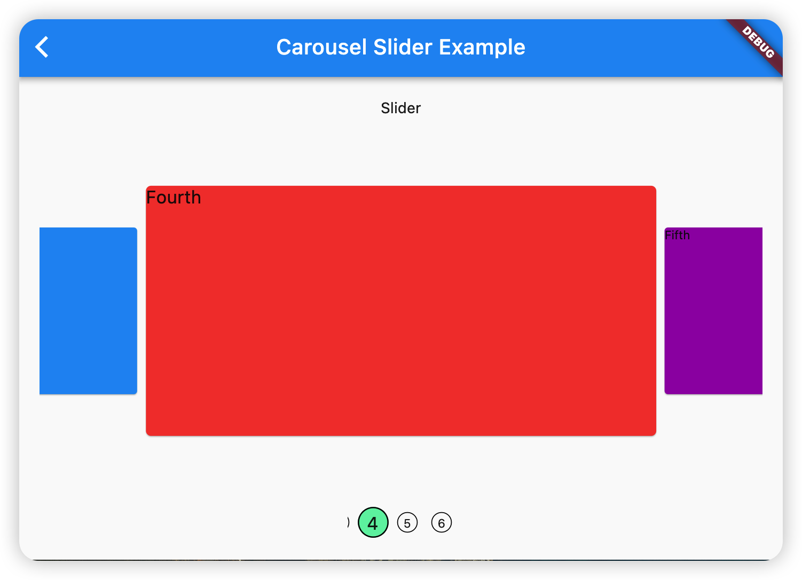

## Demo

## Designs and reasons

### Why using `CarouselEntryController` to delegate `PageController`?

- Only expose operations related to `CarouselEntry` to users. In order to support infinite scroll, we typically extend the `PageView.itemCount`, as a result, we must convert the `CarouselEntry` index to a `page` number used by `PageController`. so as a delegate of `PageController`, `CarouselEntryController` only expose operations related to `CarouselEntry` and therefore allow users to focus on the index of `CarouselEntry` instead of the `page` number.

### Why using `ValueNotifier` for `CarouselEntryController.currentEntry`?

- Typically, it is designed for building a indicator for `CarouselSlider`. In `DefaultCarouselIndicator`, each indicator dot needs to listen to the change of the current entry so as to display the correct UI corresponding to the current `CarouselEntry`.

## Problems and Solutions

### ensure the corresponding indicator item is visible

- Problem: When the `indicator` items are too much, we must put all indicator items in a `ListView`/`ScrollView`. A possible case is that some indicator items may be invisible because the widget size is not enough. For this case, we must also ensure those indicator items are visible when we slide the entries of `CarouselSlider` directly. for example:
  
- Solution:
  1. by using `ScrollController.animateTo/jumpTo`, we can scroll the list view to ta specific `Offset`
  2. all indicator items typically have the same/similar size, and we only need to ensure a indicator item is visible instead of positioning it explicitly.
  3. by listening to the change of `CarouselEntryController.currentEntry`, we could estimate the offset for the current `CarouselEntry` in the list view.

## TODO

1. `CarouselSlider.aspectRatio` may not work well for `CarouselSlider.centerScale` when `CarouselSlider.enlargeCenter = true`. For example, `aspectRatio = 1/1`, `centerScale > 1`, the center `CarouselEntry` may be clipped.
2. support `Axis.vertical` for the indicator of `CarouselSlider`.
