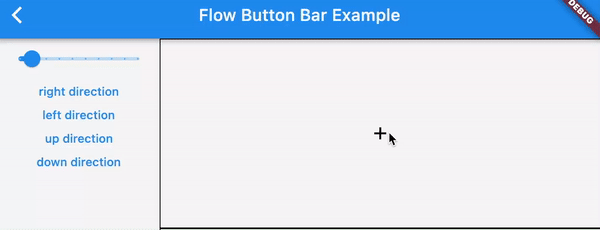
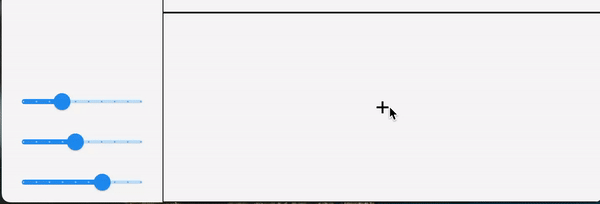
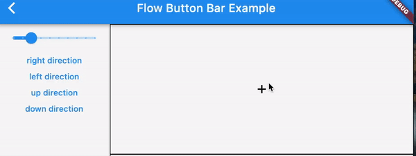
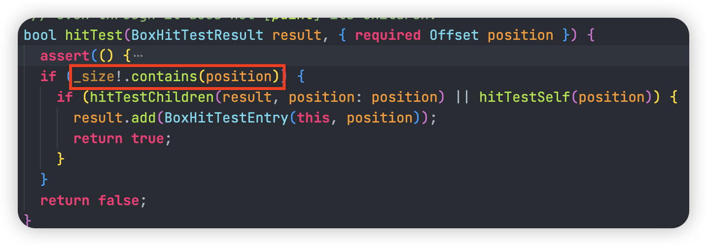

# demo

### Linear Flow Button Bar

### Circular Flow Button Bar

## Designs and reasons

### why the first `FlowEntry` for `FlowButtonBar.entries` default as the main entry?

if not, I have to control how to position and paint the effective entries separately whenever the button bar is toggled

### why and how positioning each entry relative to the main entry?

- `FlowPaintingContext` will give us a relative origin, so we only need to align the main entry before position other entries. By calling `ButtonFlowDelegate.alignMainEntry`, I could ensure the main entry is aligned to the size of `FlowPaintingContext` by `ButtonFlowDelegate.alignment`
- All entries will share the aligned origin (returned by `ButtonFlowDelegate.alignMainEntry`). Therefore, a concrete implementation of `ButtonFlowDelegate` only need to care about how to calculate the relative position and then combine the position with the aligned origin in `transform`

### why abstracting `calculateOffset` and `transform` method?

- for linear and circular delegates, the main differences between them are about how to calculate the positions for all entries and then apply the position by transforming. By abstracting the two methods, the two delegates can extend from `ButtonFlowDelegate` and focus on handling the two methods.
- besides, I also want to support more kinds of flow delegates, so such an abstraction can extend more features easily in the future.

## Problems an solutions

### explicitly distribute entries to the specific position

- `LinearFlowButtonDelegate`

  - PROBLEM: each entry may have different size, so we must ensure the gap between adjacent entries is same.
  - SOLUTION: we could record the previous entry's top-left position, but we need also add the previous entry's width/height determined by `LinearFlowButtonDelegate.direction`. Therefore, we could position the next entry using the same `buttonGap` based on its previous entry's position, and there is no need to know the size if its previous entry

- `CircularFlowButtonDelegate`

  - PROBLEM: the problem is similar to the linear one: the distance between each entry and the main entry should be same, while entries may have different size.
  - SOLUTION: we could calculate `dx` and `dy` separately based on the given `radius` and the main entry's size. When the entry is put at the same horizontal line as the main entry, we have `dx = HR * cos(radian)`, while they in the same vertical line, we have `dy = VR * sin(radian)`. Because all other entries refer to the main entry, we could infer: `HR = radius + mainEntrySize.width`, `VR = radius + mainEntrySize.height`

## Possible issues

### some buttons may not respond to `onPressed` event if `FlowButtonBar` is over its given size when expanding all buttons.

In the above gif, some buttons are painted outside the black box border (it turns out the actual painted size is greater than the given/constrained size of `FlowButtonBar`). For this case, tapping those over-boundary buttons will not work, because Flutter only handles gestures if the given size contains the tapped position.

In comparison, we could see that tapping those in-boundary buttons will toggle `FlowButtonBar` correctly.
